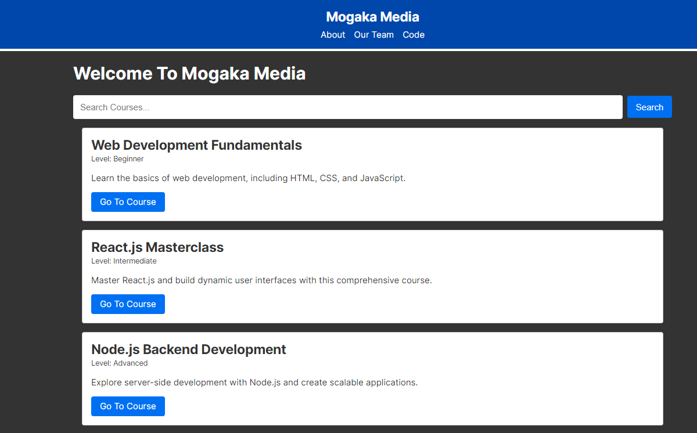
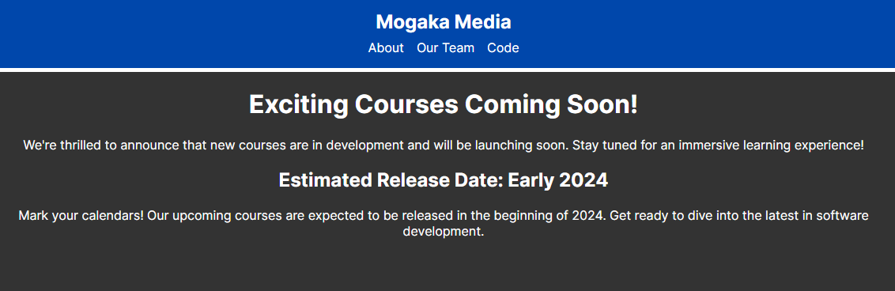
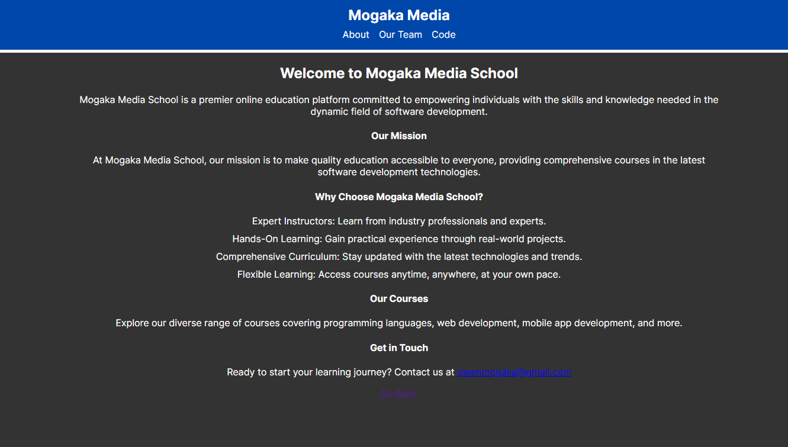
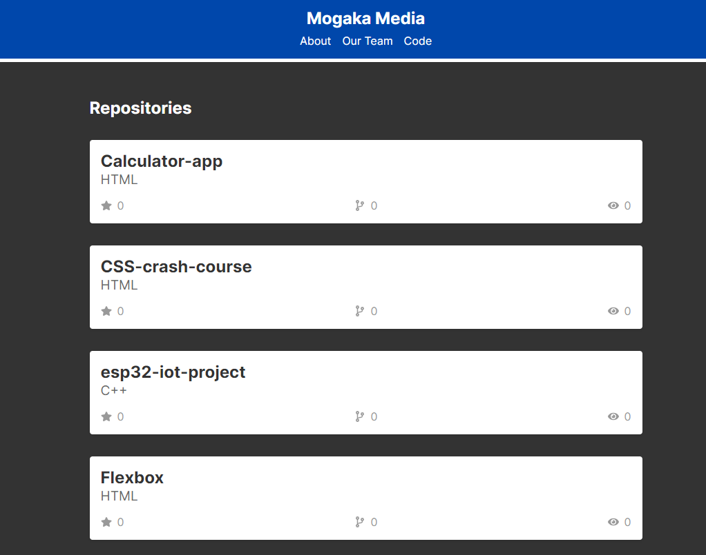
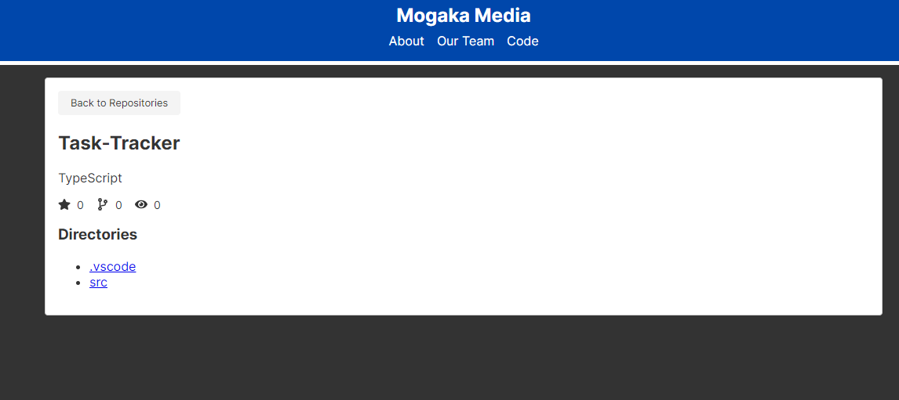

# NextJS Practice

## In this repo, I learnt the basics of nextjs and built a simple app to display a website for an online education platform and the courses offered

### This application implements the basics of nextJS including routing, navigation, layouts, metadata API, client vs server, data fetching,api routes, and query params

## Home Page

---

#### Clicking go to course directs you to this page

## About Page

## Our Team Page

## Code Page

This data is fetched from my github profile repositories.

#### Clicking on a repository opens up a new page to display its directories

